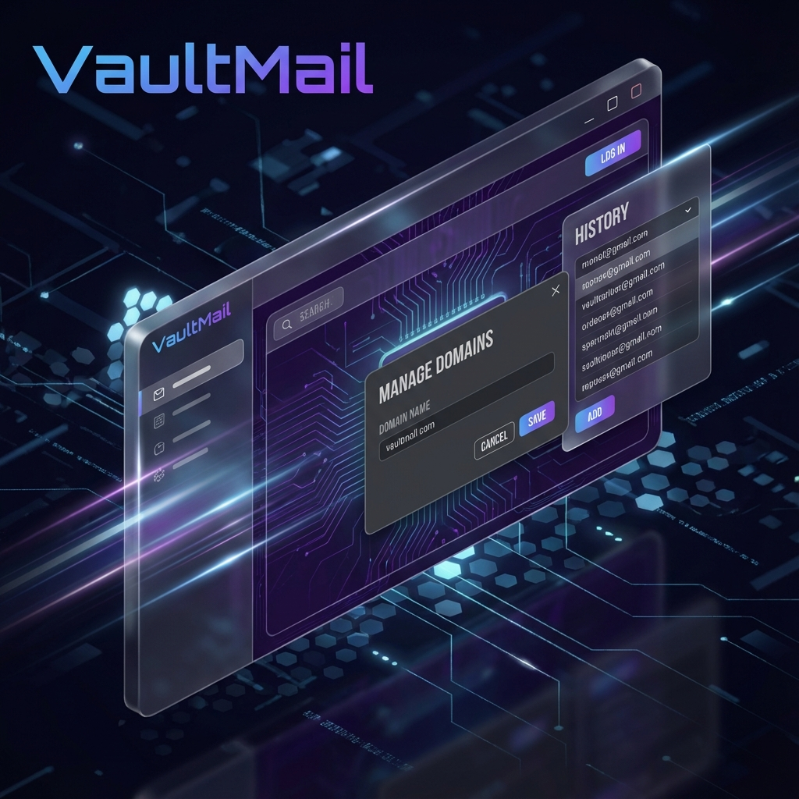

# VaultMail - Private, Serverless Disposable Mail



A premium, privacy-focused disposable email service built with **Next.js** and **Upstash Redis**. Features real-time inbox updates, custom domain support, and configurable privacy settings.

  

## ✨ Features

-   **🛡️ Privacy First**: Emails are stored in short-lived Redis keys with auto-expiry.
-   **⚙️ Configurable Retention**: Users can set email lifespan from **30 minutes** to **1 week**.
-   **🌐 Custom Domains**: Bring your own domain via Cloudflare or Mailgun (Manage Domains GUI included).
-   **⚡ Real-time**: Instant email delivery and inbox updates.
-   **🎨 Premium UI**: Glassmorphism aesthetic, Dark Mode, and responsive mobile design.
-   **📜 History**: Locally stored history of generated addresses for quick access.
-   **🔗 Pretty URLs**: Shareable links like `https://app.com/user@domain.com`.

## 🏗️ Architecture

1.  **Incoming Mail**: DNS MX Records point to your email routing service (Cloudflare/Mailgun).
2.  **Webhook**: The service forwards the raw email to `https://your-app.com/api/webhook`.
3.  **Processing**: The app parses the email, checks user retention settings, and stores it in **Upstash Redis**.
4.  **Frontend**: The Next.js UI polls the API to display emails for the current address.

## 🚀 Deployment Guide

### 1. Deploy to Vercel

Clone this repository and deploy it to Vercel.

### 2. Configure Database (Upstash Redis)

1.  Go to the **Storage** tab in your Vercel Project.
2.  Click **Connect Store** and select **Upstash Redis** from the Marketplace.
3.  Link it to your project. This will automagically set:
    *   `UPSTASH_REDIS_REST_URL`
    *   `UPSTASH_REDIS_REST_TOKEN`

### 3. Configure Email Forwarding

You need a service to receive SMTP traffic and forward it to your app's webhook.

#### Recommended: Cloudflare Email Workers (Free)
We include a pre-configured worker in the `worker/` directory.

1.  **Setup Cloudflare**:
    *   Add your domain to Cloudflare.
    *   Enable **Email Routing** in the Cloudflare Dashboard.

2.  **Deploy the Worker**:
    ```bash
    cd worker
    npm install
    # Edit src/index.js -> Update TARGET_URL to your Vercel URL
    npm run deploy
    ```

3.  **Route Emails**:
    *   In Cloudflare Email Routing > **Routes**.
    *   Create a "Catch-All" route.
    *   Action: `Send to Worker` -> Destination: `dispomail-forwarder` (or whatever you named it).

## 🛠️ Local Development

1.  **Install Dependencies**:
    ```bash
    npm install
    ```

2.  **Environment Setup**:
    Create `.env.local` and add your Upstash Redis credentials:
    ```env
    UPSTASH_REDIS_REST_URL="your-url"
    UPSTASH_REDIS_REST_TOKEN="your-token"
    ```

3.  **Run Development Server**:
    ```bash
    npm run dev
    ```

## 📜 License

MIT License. Feel free to fork and deploy your own private email shield.
